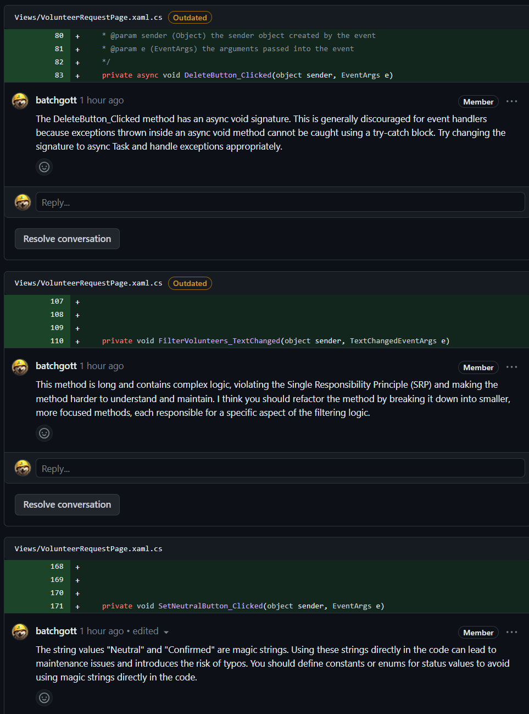
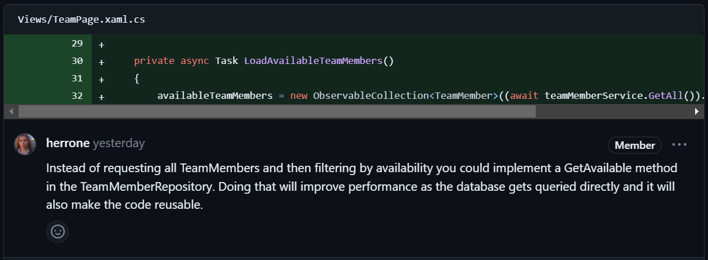
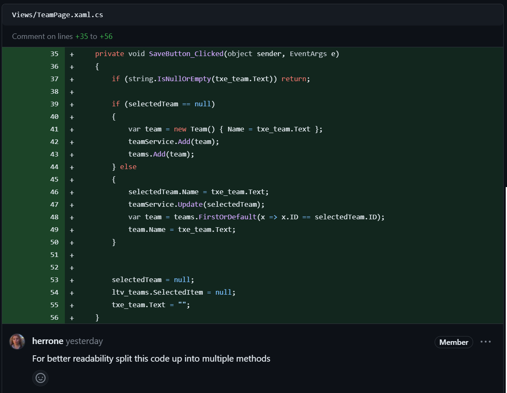
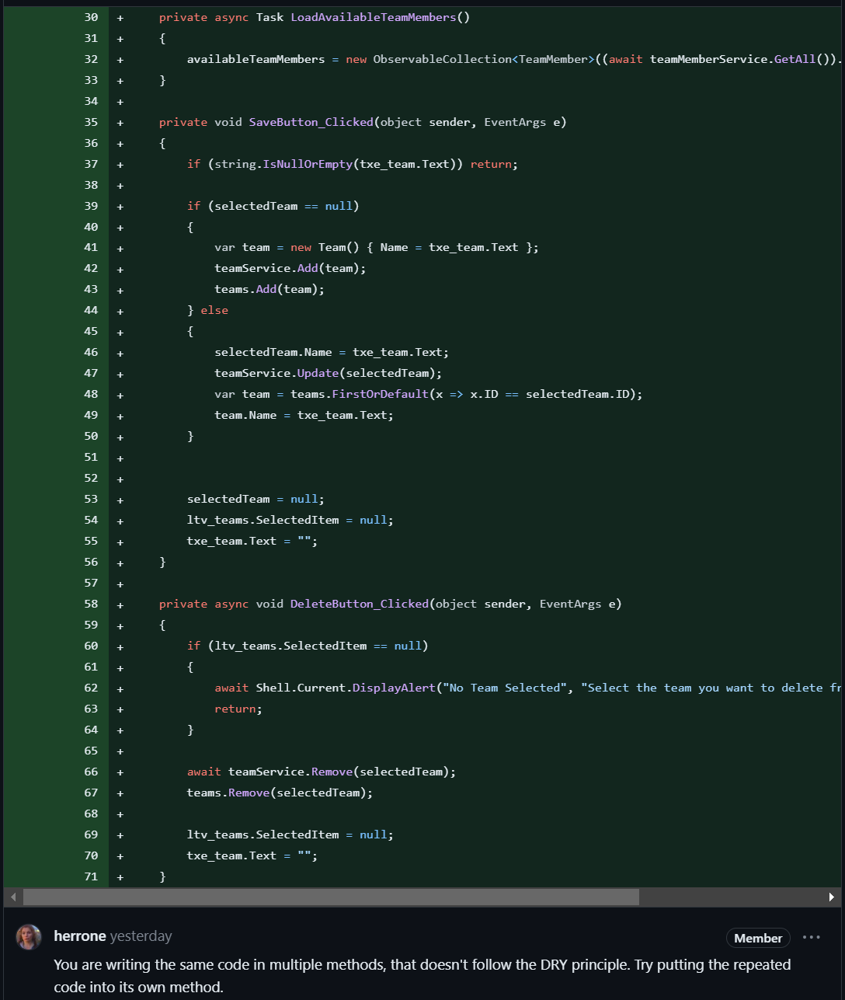
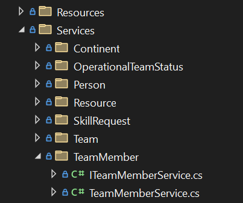

# Project work 2
This week I worked on creating the Team page. On the page it is possible to delete, edit and create new teams. This is the first step in completing the issue about forming operational sub-teams as efficient as possible.

The Team feature is part of [this issue](https://github.com/Software-Engineering-Red/MAUI-APP/issues/135).

### Creating Team Model and Service
To create the team model we can make use of the `AModel` class so write less code and not duplicate it again and again. A team needs to have a many-to-one relationship with `TeamMember` and that is why we have a list of `TeamMember` inside the team class.

```csharp
    public class Team : AModel
    {
        public Team()
        {
            TeamMembers = new();
        }

        private string _name;
        public string Name
        {
            get => _name;
            set => SetField(ref _name, value);
        }

        private List<TeamMember> _teamMembers;
        public List<TeamMember> TeamMembers
        {
            get => _teamMembers;
            set => SetField(ref _teamMembers, value);
        }
    }
```

We can also make use of the `AService` class we created last week and now to implement the CRUD methods we only need to write two lines of code instead of 70.

```csharp
    public interface ITeamMemberService : IService<TeamMember> {}
    public class TeamMemberService : AService<TeamMember>, ITeamMemberService {}
```

### View
The code for the view is very long and that is why there is only the link provided instead of posting it in the portfolio:

- [XAML View File](https://github.com/Software-Engineering-Red/MAUI-APP/pull/133/files#diff-e946b480b8a25ed8c2142911ff0c1748896b74cafa1dd3e0839872f3c9e5209f)
- [Code View File](https://github.com/Software-Engineering-Red/MAUI-APP/pull/133/files#diff-cb590ee452d2ca0af385b1c19f59cb37accf6a48c72d5e4462232cda9404ce13)

### Test
For the testing the framework [Moq](https://github.com/devlooped/moq) and [xUnit](https://xunit.net/) was used. Here is an example for a test:

```csharp

public class TeamMemberServiceTests
{
    private readonly Mock<SQLiteAsyncConnection> _mockDatabase;
    private readonly TeamMemberService _service;

    public TeamMemberServiceTests()
    {
        _mockDatabase = new Mock<SQLiteAsyncConnection>();
        _service = new TeamMemberService(_mockDatabase.Object);
    }

    [Fact]
    public async Task GetAvailable_ShouldReturnAvailableTeamMembers()
    {
        var expectedTeamMembers = new List<TeamMember>
        {
            new TeamMember { name = "TestName1" },
            new TeamMember { name = "TestName2" }
        };

        _mockDatabase.Setup(db => db.Table<TeamMember>())
                     .ReturnsAsync(expectedTeamMembers);

        var result = await _service.GetAvailable();
        Assert.Equal(expectedTeamMembers.Count, result.Count);
    }

    ...
}
```

## Reviewing Code
I was asked to conduct a code review for this [PR](https://github.com/Software-Engineering-Red/MAUI-APP/pull/134). I found the following issues in the code (Fig.1):

<figure>

<figcaption align="center"><b>Fig.1 - Comments on PR</b></figcaption>
</figure>

The changes I requested are mainly about following conventional programming principles like applying [DRY](https://en.wikipedia.org/wiki/Don%27t_repeat_yourself) and using [exception handling](https://en.wikipedia.org/wiki/Exception_handling) when appropriate.


## Code Review
In the code review I got the following comments about my code:

<figure>

<figcaption align="center"><b>Fig.2 - PR comment 1</b></figcaption>
</figure>

To follow that request and make the code more reusable I made the following change in the code base:

```csharp
    public interface ITeamMemberService : IService<TeamMember> {
        public Task<List<TeamMember>> GetAvailable();
    }

    public class TeamMemberService : AService<TeamMember>, ITeamMemberService
    {
        public async Task<List<TeamMember>> GetAvailable()
        {
            return await _database.Table<TeamMember>().Where(t => t.Available).ToListAsync();
        }
    }
```

Having a Service class gives us the flexibility add any method we want to query the database and we can use the method anywhere in the code.

___

<figure>

<figcaption align="center"><b>Fig.3 - PR comment 2</b></figcaption>
</figure>

To reflect the changes requested in Fig.3 I added a method for `AddTeam` and `UpdateTeam` and changed the `SaveButton_Clicked` the following way:

```csharp
    public void SaveButton_Clicked(object sender, EventArgs e)
    {
        if (string.IsNullOrEmpty(txe_team.Text)) return;

        if (selectedTeam == null)
            AddTeam();
        else
            UpdateTeam();
        
        selectedTeam = null;
        ltv_teams.SelectedItem = null;
        txe_team.Text = "";
    }

    public void AddTeam()
    {
        var team = new Team() { Name = txe_team.Text };
        teamService.Add(team);
        teams.Add(team);
    }

    public void UpdateTeam()
    {
        selectedTeam.Name = txe_team.Text;
        teamService.Update(selectedTeam);
        var team = teams.FirstOrDefault(x => x.ID == selectedTeam.ID);
        team.Name = txe_team.Text;
    }
```

___

<figure>

<figcaption align="center"><b>Fig.4 - PR comment 3</b></figcaption>
</figure>

Following what is recommended in the comment of Fig.4 we can improve the code of our view even further by creating a `RemoveSelection` method.

```csharp
    public void SaveButton_Clicked(object sender, EventArgs e)
    {
        if (string.IsNullOrEmpty(txe_team.Text)) return;

        if (selectedTeam == null)
            AddTeam();
        else
            UpdateTeam();
        
        selectedTeam = null;
        RemoveSelection();
    }

    public async void DeleteButton_Clicked(object sender, EventArgs e)
    {
        if (ltv_teams.SelectedItem == null)
        {
            await Shell.Current.DisplayAlert("No Team Selected", "Select the team you want to delete from the list", "OK");
            return;
        }

        await teamService.Remove(selectedTeam);
        teams.Remove(selectedTeam);

        RemoveSelection();
    }

    public void RemoveSelection()
    {
        ltv_teams.SelectedItem = null;
        txe_team.Text = "";
    }
```


## Reflection
### Fixing error in the abstract Service
Changing the `_database` variable in from private to protected in the `AService<T>` class was an important fix. Originally, `_database` was private, which meant only the `AService<T>` class could use it. This was too limiting and an oversight. By making `_database` protected, now classes that inherit from `AService<T>` can also use this variable.

This change is a good balance. It still keeps important details hidden from classes that should not see them, but lets subclass use the database connection. This allows for more specific and advanced use of the database in subclasses. It is important, though, for anyone using this in a subclass to understand how it works and use it correctly to avoid problems with the database.

This is how the code was changed:

```csharp
    public abstract class AService<T> : IService<T> where T : AModel,new()
    {
        protected SQLiteAsyncConnection _database;

        ...
    }
```

### Teamwork Reflection
In our recent team reflection, we recognized the critical need for more structured coordination through weekly meetings. This realization came after an incident last week, where two of our team members independently worked on the same functionality but approached it differently. This overlap was not identified early enough, resulting in significant challenges during the merge process, as their implementations conflicted with each other.

To address this, we have agreed that during our weekly meetings, each team member will clearly outline the specific issue they are working on, including a brief description of their planned approach. This practice will serve as a checkpoint to ensure that everyone is aware of each other's tasks, particularly focusing on areas where there is potential for overlapping functionality. By doing so, if someone is working on something that aligns or intersects with another team member's task, they can immediately reach out, discuss, and collaborate. This proactive communication is expected to enhance our team synergy, minimize redundant work, and prevent integration problems that arise from parallel development.

Moreover, these meetings will also act as a platform for team members to seek input or assistance on challenges they are facing, fostering a more collaborative and supportive work environment. This improvement in our teamwork approach is a crucial step towards more efficient and harmonious project development, ensuring smoother progress and higher quality outcomes.


### Application structure
In the last few weeks our team noticed that it got increasingly harder to find a service class just because of the sheer amount of service classes and because they are ordered alphabetically. To avoid that we started creating folders for each service and its interface so we only need to look for the right folder to find both the class and the interface (Fig.5).

<figure>

<figcaption align="center"><b>Fig.5 - New folder structure</b></figcaption>
</figure>