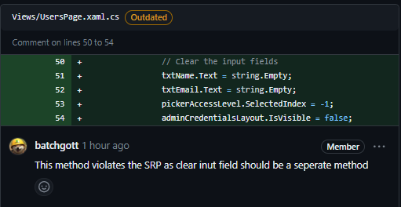
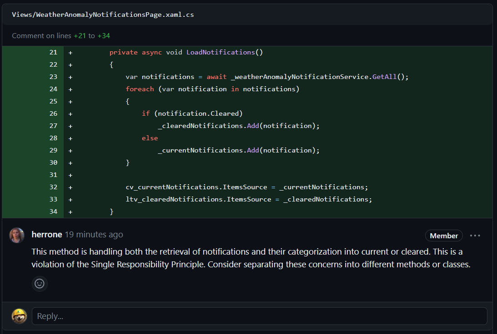
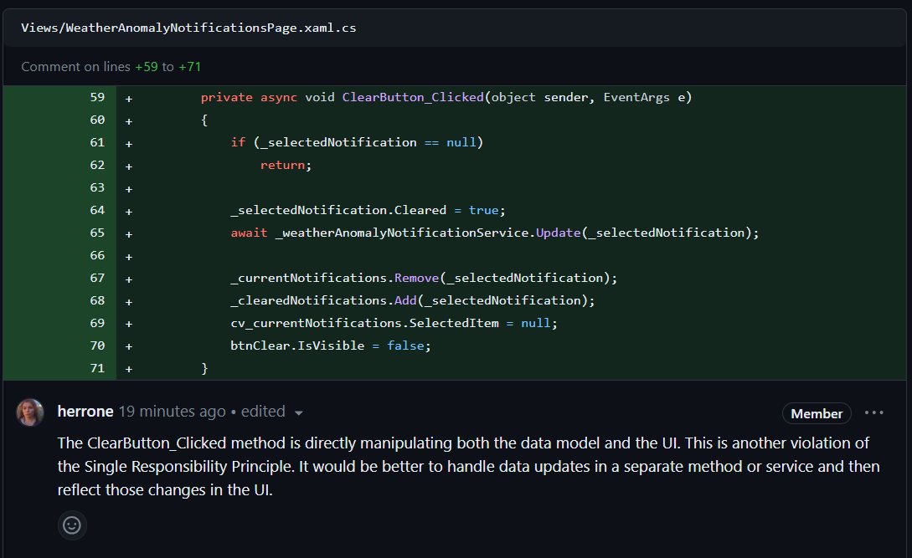
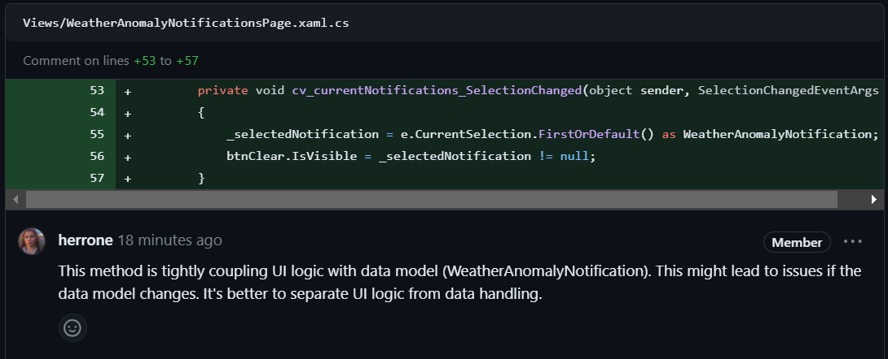
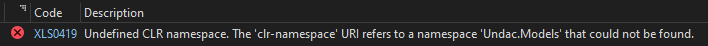

# Project work 4
This week I worked on a new feature called weather anomaly notification. The idea of this feature is that everyone should be able to report weather anomalies and create notifications for everyone to see. Once the weather anonmaly is cleared it should be possible to also notify the UNDAC Team Leader and changing the anomaly notification in the system to "cleared".

The Team feature is part of [this issue](https://github.com/Software-Engineering-Red/MAUI-APP/issues/180).

### Creating Team Model and Service
To create the `WeatherAnomalyNotification` model we can make use of the `AModel` class so write less code and not duplicate it again and again. A `WeatherAnomalyNotification` needs a `message`, a `DateTime` for when the anomaly was recorded and a boolean for `clearing` the notification.

```csharp
    public class WeatherAnomalyNotification : AModel
    {

        private string _message;
        public string Message
        {
            get => _message;
            set => SetField(ref _message, value);
        }

        private DateTime _createdAt;
        public DateTime CreatedAt
        {
            get => _createdAt;
            set => SetField(ref _createdAt, value);
        }

        private bool _cleared;
        public bool Cleared
        {
            get => _cleared;
            set => SetField(ref _cleared, value);
        }
    }
```
Additionally, we can again make use of the `AService` class, same as last week, to no have to implement the CRUD methods and instead we write just two lines.

```csharp
    public interface IWeatherAnomalyNotificationService : IService<WeatherAnomalyNotification> {}
    public class WeatherAnomalyNotificationService : AService<WeatherAnomalyNotification>, IWeatherAnomalyNotificationService {}
```

### View
The code for the view is very long so instead of pasting it all in the porfolio we will only look at the most important parts. Here are the links to the complete view code:

- [XAML View File](https://github.com/Software-Engineering-Red/MAUI-APP/pull/181/files#diff-c32314d3b8c16152c7fe38ffa74a177162afbc0e52472cb687ffe87de379f2ce)
- [Code View File](https://github.com/Software-Engineering-Red/MAUI-APP/pull/181/files#diff-99f9792944e2c1b4bd968c7363260c6d36fa32d247b2c81993bb78e47a7337c2)

#### Adapting view for scrolling
The content of this view can get very long, if there are a lot of wheater anomalies. To make sure the users can still see all anomalies we have to wrap our `StackLayout` inside a `ScrollView`. 

```csharp
<ContentPage xmlns="http://schemas.microsoft.com/dotnet/2021/maui"
             xmlns:x="http://schemas.microsoft.com/winfx/2009/xaml"
             x:Class="UndacApp.Views.WeatherAnomalyNotificationsPage"
             Title="Weather Anomaly Notifications"
             BackgroundColor="LightSkyBlue">

    <ScrollView>
        <StackLayout Spacing="15" Margin="20">
            ...
        </StackLayout>
    </ScrollView>
</ContentPage>
```

A more thorough explanation can be found in the reflection section of this portfolio entry.

#### Databinding with CollectionView
To display all current notifications we utilize a [`CollectionView`](https://github.com/Software-Engineering-Red/MAUI-APP/pull/181/files#diff-99f9792944e2c1b4bd968c7363260c6d36fa32d247b2c81993bb78e47a7337c2). In our case it is important to set the `SelectionMode` to `Single` as we only ever want one notification to be selected by the user.
Another thing to note here is that we can set the string format when binding the `DateTime` CreatedAt to the view.

```csharp
            <CollectionView x:Name="cv_currentNotifications" SelectionMode="Single" 
                            SelectionChanged="cv_currentNotifications_SelectionChanged">
                <CollectionView.ItemTemplate>
                    <DataTemplate>
                        <Frame BorderColor="SteelBlue" Padding="10" Margin="5">
                            <StackLayout>
                                <Label Text="{Binding Message}" FontSize="16" />
                                <Label Text="{Binding CreatedAt, StringFormat='Reported on {0:MM/dd/yyyy}'}" FontSize="14" TextColor="Gray" />
                            </StackLayout>
                        </Frame>
                    </DataTemplate>
                </CollectionView.ItemTemplate>
            </CollectionView>
```

## Reviewing Code
I was asked to conduct a code review for this [PR](https://github.com/Software-Engineering-Red/MAUI-APP/pull/182). I found the following issues in the code (Fig.1):

<figure>

<figcaption align="center"><b>Fig.1 - Comment on PR</b></figcaption>
</figure>

The changes I requested are mainly about following conventional programming principles like applying [SRP](https://en.wikipedia.org/wiki/Single-responsibility_principle).


## Code Review
In the code review on [my PR](https://github.com/Software-Engineering-Red/MAUI-APP/pull/181) I got the following comments about my code:

<figure>

<figcaption align="center"><b>Fig.2 - PR comment 1</b></figcaption>
</figure>

To follow that request and split up the code for that method into two individual methods:

```csharp
        public async void LoadNotifications()
        {
            var notifications = await _weatherAnomalyNotificationService.GetAll();
            CategorizeNotifications(notifications);
            cv_currentNotifications.ItemsSource = _currentNotifications;
            ltv_clearedNotifications.ItemsSource = _clearedNotifications;
        }

        public void CategorizeNotifications(IEnumerable<WeatherAnomalyNotification> notifications)
        {
            foreach (var notification in notifications)
            {
                if (notification.Cleared)
                    _clearedNotifications.Add(notification);
                else
                    _currentNotifications.Add(notification);
            }
        }
```

___

<figure>

<figcaption align="center"><b>Fig.3 - PR comment 2</b></figcaption>
</figure>

To reflect the changes requested in Fig.3 I added a method for `UpdateUIAfterClearingNotification`:

```csharp
        public async void ClearButton_Clicked(object sender, EventArgs e)
        {
            if (_selectedNotification == null)
                return;

            await UpdateNotificationStatus(_selectedNotification);

            UpdateUIAfterClearingNotification();
        }
        
        ...

        public void UpdateUIAfterClearingNotification()
        {
            _currentNotifications.Remove(_selectedNotification);
            _clearedNotifications.Add(_selectedNotification);
            cv_currentNotifications.SelectedItem = null;
            btnClear.IsVisible = false;
        }
```

___

<figure>

<figcaption align="center"><b>Fig.4 - PR comment 3</b></figcaption>
</figure>

Following what is recommended in the comment of Fig.4 we can improve the code creating a `UpdateNotificationStatus` that can be called asynchronously.

```csharp
        public async Task UpdateNotificationStatus(WeatherAnomalyNotification notification)
        {
            notification.Cleared = true;
            await _weatherAnomalyNotificationService.Update(notification);
        }
```


## Reflection
### Using ScrollView
An issue in the project that went unnoticed so far was that if there are too many items in the `StackLayout` they will be outside of the screen and the user will be unable to see them. Fortunately, there is an easy fix. We can just wrap the `StackLayout` inside a [`ScrollView`](https://learn.microsoft.com/en-gb/dotnet/maui/user-interface/controls/scrollview?view=net-maui-8.0). A scrollview is capable of scrolling its content, either by dragging on a touchscreen or just using the scroll wheel on a computer. The ScrollView will scroll vertically by default, but it can also be used for horizontal scrolling.

### Fixing Namespace Error
When I was working on my own branch this week the following error (Fig.5) occured in the `RotaPage` and the `OrderStatusPage` even though my changes were unrelated to those pages and I did not change anything in the code.

<figure>

<figcaption align="center"><b>Fig.4 - Namespace error</b></figcaption>
</figure>

To fix the issue I simply had to remove this line from the `ContentPage` definition:

```csharp
             xmlns:local="clr-namespace:Undac.Models"
```

### Changes in personal Workflow
#### Pulling more frequently
Often times before when I was working on my own branch, when I was done implementing the feature I had a lot of issues merging my changes into the base branch. The problem was that many of the other people in the team were pushing their changes onto the base branch while I was still working with an older version of the base branch and that caused a lot of merge issues. 
To avoid that I started pulling the base branch onto my branch regularly. I still have to solve merge conflicts but now instead of one big merge conflict I only have small ones.