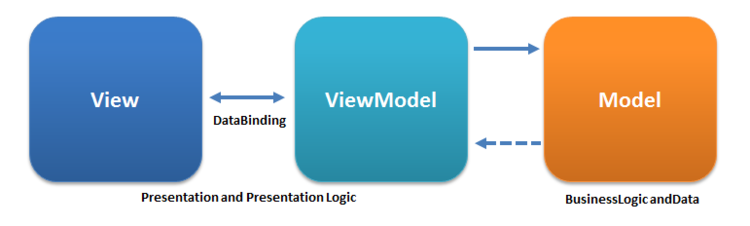

# Project work 5
This week I worked in improving and refactoring the weather anomaly notification that I worked on last week. To make the code more robust and maintainable I wanted to make use of the [Model-View-ViewModel pattern](https://en.wikipedia.org/wiki/Model%E2%80%93view%E2%80%93viewmodel) and also the [Command Pattern](https://en.wikipedia.org/wiki/Command_pattern). Both concepts will be described in the **Reflection** section in more detail.

The refactoring is part of [this issue](https://github.com/Software-Engineering-Red/MAUI-APP/issues/187).

### Using ICommand to implement Command Pattern
The following code snipped it an example of how to use the [ICommand interface](https://learn.microsoft.com/en-us/dotnet/api/system.windows.input.icommand?view=net-8.0) to implement the Command Pattern in MAUI. 

```csharp
    public class ClearNotificationCommand : ICommand
    {
        private readonly Action _execute;

        public event EventHandler CanExecuteChanged;

        public ClearNotificationCommand(Action executeAction)
        {
            _execute = executeAction ?? throw new ArgumentNullException(nameof(executeAction));
        }

        public bool CanExecute(object parameter)
        {
            return true;
        }

        public void Execute(object parameter)
        {
            _execute?.Invoke();
        }
    }
```

Using the ICommand interface gives exposes the methods `CanExecute` and `Execute`. Those methods will be used by the view when the command gets bound to a button like in the code snippet below.

```csharp
        ...
            <Button x:Name="btnClear"
                    Text="Mark as Cleared"
                    BackgroundColor="DarkCyan"
                    TextColor="White"
                    Command="{Binding ClearNotificationCommand}"
                    IsVisible="{Binding IsClearButtonVisible}" />
        ...
```

### Creating the ViewModel
Creating a `WeatherAnomalyNotificationsViewModel` allows us to encapsulate the business logic for the weather anomaly notification feature in a seperate class and we can remove it from the view. That creates a better seperation of concerns. A more detailed explanation can be found in the Reflection section.
The code for the ViewModel is very long so only the link to the file in the PR is provided to keep the portfolio concise: https://github.com/Software-Engineering-Red/MAUI-APP/pull/188/files#diff-a6f44a1b95def87b13a6a7b2125fcd63b73157d4a9d34429880fbd7c1c137a64

### Simplify View Code
Using MVVM significantly reduces the complexity of the view code. Now instead of containing all the business logic the View simply sets the ViewModel as the BindingContext.

```csharp
public partial class WeatherAnomalyNotificationsPage : ContentPage
    {
        public WeatherAnomalyNotificationsPage()
        {
            InitializeComponent();
            BindingContext = new WeatherAnomalyNotificationsViewModel();
        }
    }
```

## Reviewing Code
I was asked to conduct a code review for this [PR](https://github.com/Software-Engineering-Red/MAUI-APP/pull/190). I found the following issues in the code (Fig.1):

<figure>

<figcaption align="center"><b>Fig.1 - Comment on PR</b></figcaption>
</figure>

Both methods have similar issues. They are too complex and there is too much nesting which makes the code very hard to follow. To significantly reduce the complexity of the code and improve the readability I suggested making use of [guard clauses](https://deviq.com/design-patterns/guard-clause).

## Code Review
In the code review on [my PR](https://github.com/Software-Engineering-Red/MAUI-APP/pull/188) I got the following comments about my code:

<figure>

<figcaption align="center"><b>Fig.2 - PR comment</b></figcaption>
</figure>

The issue is that I forgot to remove the `INotifyPropertyChanged` interface from the Model class which causes the view to trigger an event twice when there is a change because we are already implementing the `INotifyPropertyChanged` interface in the ViewModel. Remove the interface from the model class also significantly reduces the complexity of the model code:

```csharp
    public class WeatherAnomalyNotification
    {
        [PrimaryKey, AutoIncrement]
        public int ID { get; set; }
        public string Message { get; set; }
        public DateTime CreatedAt { get; set; }
        public bool Cleared { get; set; }
    }
```

## Reflection
### Using MVVM (Model-View-ViewModel)
This week I decided to refactor the code I wrote previous week to increase the overall code quality of the project. One crucial factor for this is using the [Model-View-ViewModel](https://en.wikipedia.org/wiki/Model%E2%80%93view%E2%80%93viewmodel) software architecture pattern. 

It works by dividing an application into three interconnected parts. The Model represents the data and business logic; the View is the user interface, showing the data; and the ViewModel acts as a link between the Model and the View, handling logic for the UI. In this setup, the ViewModel communicates with the Model to get and update data, then formats it in a way the View can easily display. Fig.3 gives a visual explanation.

<figure>

<figcaption align="center"><b>Fig.3 - MVVM</b></figcaption>
</figure>


#### Advantages of using MVVM

- **Separation of Concerns**: MVVM segregates the graphical user interface (UI) from the business logic and data model, leading to a cleaner and more manageable codebase. This separation makes it easier for developers to work on the UI and business logic independently.

- **Improved Maintainability**: By dividing the application into layers, MVVM makes it easier to maintain and update. Changes in one part of the application, such as the business logic or data model, can be made with minimal impact on the other parts.

- **Enhanced Testability**: The separation of concerns facilitates easier testing. The ViewModel can be tested separately from the UI, making unit testing more straightforward. This is especially beneficial for complex applications where testing can become cumbersome.

- **Data Binding**: Databinding automatically synchronizes data between the View and the ViewModel. This reduces the need for boilerplate code to move data in and out of the UI and ensures that the UI stays consistent with the underlying data model.

### Using the Command Pattern
Generally, using [software design patterns](https://en.wikipedia.org/wiki/Software_design_pattern) makes sense because they are like tested recipes for solving common problems in programming. They help us write code faster since we do not have to figure out everything from scratch. It is also easier to talk about our code with others because these patterns have specific names that many programmers know. Additionally, our code becomes cleaner and easier to fix or change later.

Refactoring our code to MVVM gives us the opportunity to use a desgin pattern: [Command Pattern](https://en.wikipedia.org/wiki/Command_pattern).

The Command pattern turns requests or simple operations into objects. This pattern involves a command interface, concrete commands implementing this interface, an invoker that calls the command, and a receiver that performs the action. This structure allows for flexible and extensible command-based operations in an application (Fig.4). 

<figure>

<figcaption align="center"><b>Fig.4 - Command Pattern</b></figcaption>
</figure>

#### Implementing the command pattern with MVVM
In the context of MVVM, there is a special way to implement the Command Pattern. For our **ConcreteCommand** we can make use of the [ICommand interface](https://learn.microsoft.com/en-us/dotnet/api/system.windows.input.icommand?view=net-8.0) that already exists in MAUI. It is an interface that contains an *Execute* and a *CanExecute* method and it can be used within the XAML file for databinding.

The **Caller** in our implementation is the View, a command gets called by clicking the button it is bound to.

The **Receiver** is the ViewModel because it contains the action we want to execute.


#### Advantages of using Command Pattern
- **Reusability**: Commands can be reused across different parts of the UI, reducing code duplication.

- **Flexibility and Extensibility**: Changes in the business logic or user interface can be made independently without affecting each other, making the application more flexible and easier to extend.

- **Bindable User Interactions**: Commands can be easily bound to UI elements in the View, like buttons and menus, which simplifies the handling of user interactions.


### Workflow Changes
#### Increase number of Code Reviewers
We noticed that by only having one reviewer on bigger pull requests, things sometimes slip through the cracks. The minimum requirement of reviewers is still one, but now whenever there are bigger or more complex changes we try to have at least two other people review the code. The second or third reviewer is not strictly defined. How it works is that whenever someone has a bigger PR they will post it in the project group chat and ask for more people to review it. That will help prevent errors that previously went unnoticed.

#### Abstracting repeated Code
As noted in previous portfolio entries, there is a lot of repeated code due to the number of people working on the project. We have now started to coordinate better and write code that is reusable. In addition to the [AModel](https://github.com/Software-Engineering-Red/MAUI-APP/blob/develop/Models/AModel.cs) class we now also have the [ANameModel](https://github.com/Software-Engineering-Red/MAUI-APP/blob/develop/Models/ANameModel.cs) class which is a model that uses the string name as a primary key instead of an integer. There is also a class called [AResource](https://github.com/Software-Engineering-Red/MAUI-APP/blob/develop/Models/AResource.cs) encapsulating similar logic for the different resource types.

#### Learning from Team Collaboration
In the course of this project, I have realized the immense value of learning from my teammates. Initially, my approach to coding was largely independent, but observing the diverse methods and strategies of others has significantly improved my own skills. I began to incorporate elements from their code into mine, such as the MVVM pattern or more elegant error handling techniques. I have noticed a big improvement in both my coding abilities and our collective output as a team.

#### Evolving Coding Practices
I have tried to adopt new good coding practice every week to improve the quality of code I produce. This has included using [guard clauses](https://deviq.com/design-patterns/guard-clause) for cleaner methods, limiting nesting to three levels for better readability, leveraging modern C# features ([properties](https://learn.microsoft.com/en-us/dotnet/csharp/programming-guide/classes-and-structs/properties), [ternary operator](https://learn.microsoft.com/en-us/dotnet/csharp/language-reference/operators/conditional-operator), [LINQ extension methods](https://www.c-sharpcorner.com/article/linq-extension-methods/), ...), utilizing useful MAUI features ([ICommand](https://learn.microsoft.com/en-us/dotnet/api/system.windows.input.icommand?view=net-8.0), [MVVM](https://learn.microsoft.com/en-us/dotnet/maui/xaml/fundamentals/mvvm?view=net-maui-8.0), [ScrollView](https://learn.microsoft.com/cs-cz/dotnet/maui/user-interface/controls/scrollview?view=net-maui-8.0), [CollectionView](https://learn.microsoft.com/en-us/dotnet/maui/user-interface/controls/collectionview/?view=net-maui-8.0), [Databinding](https://learn.microsoft.com/en-us/dotnet/maui/fundamentals/data-binding/?view=net-maui-8.0), ...) and many more. These changes are making my code more efficient and easier to manage. It has been a great way to learn and apply these practices in the setting of the group project.