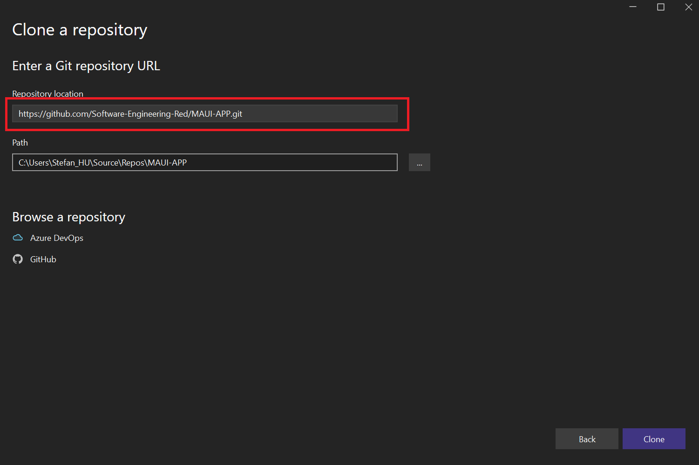

# Setup

## Environment configuration

The first thing that needs to be done to set up the development environment is to download or update Visual Studio. The easiest way to do that is by using the Visual Studio Installer (Fig.1).

We also need to click on *Modify* and and add the **.NET Multi-platform App UI development (MAUI)** workload to the Visual Studio installation (Fig.2). 

<figure>

<figcaption align="center"><b>Fig.1 - Visual Studio</b></figcaption>
</figure>

<figure>

<figcaption align="center"><b>Fig.2 - Add the MAUI workload</b></figcaption>
</figure>

After Visual Studio is installed and up-to-date we can launch it and use the option "Clone a repository" to get started. Here we can paste the URL to our repository and clone it as can be seen in Fig.3.

<figure>

<figcaption align="center"><b>Fig.3 - Cloning the Repository</b></figcaption>
</figure>

Once the cloning is completed the IDE should open and show all the project files (Fig.4). To run the application you need to click on "Windows Machine".

<figure>

<figcaption align="center"><b>Fig.4 - Project files in Visual Studio</b></figcaption>
</figure>

Before the application gets started you will be prompted a window where you need to enable Developer Mode (Fig.5).

<figure>

<figcaption align="center"><b>Fig.5 - Turn on Developer Mode</b></figcaption>
</figure>

Now the MAUI App should run (Fig.6).

<figure>

<figcaption align="center"><b>Fig.6 - MAUI App running</b></figcaption>
</figure>

## Reflection
#### Why MAUI

MAUI is a new framework from Microsoft who have a track record of build great application development tools. The purpose of MAUI is to build Cross-Platform apps with only one codebase which significantly reduces development time when we want to create an app for all platforms. MAUI solves the issue other Microsoft front-end frameworks like XAMARIN and WPF had were you could only build an app for one or two specific platforms.

#### When would MAUI not be a good choice
If we build an app that needs to have really good performance and also really robust it might be better to build it using native platforms like Swift for iOS or Android Studio for Android phones. Fortunately, the performance of MAUI will be sufficient for 99% of use cases.

#### Running the Application on Android instead of Windows
As MAUI is used for Cross-Platform development we can also run and test it on other platforms like Android. To start it in an Android Environment we first need to download an Emulator in Visual Studio and then use it to start the MAUI App instead of "Windows Machine" (Fig.7).

<figure>

<figcaption align="center"><b>Fig.7 - Run with Android</b></figcaption>
</figure>
