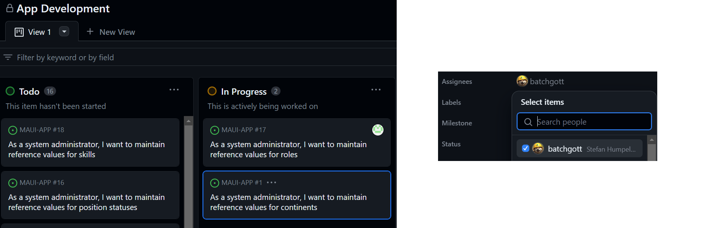

# Workflow
## Task workflow
#### Tasks in Github
To start working on a task we need to first pick one from the project backlog, move to "In Progress" click on it and assign the task to the appropriate user in the list to let the other developers know who is working on that task (Fig.1).

<figure>

<figcaption align="center"><b>Fig.1 - Pick a task and assign to user</b></figcaption>
</figure>


In the issue view you can edit the description to add more information about how the task should be completed (Fig.2). Here is a link to [the issue](https://github.com/Software-Engineering-Red/MAUI-APP/issues/1).


<figure>

<figcaption align="center"><b>Fig.2 - Issue View</b></figcaption>
</figure>

Now, by clicking on "create a branch" in the issue a window will pop up that allows us to genereate a feature branch on which we can start working on the implementation(Fig.3).


<figure>

<figcaption align="center"><b>Fig.3 - Creating a feature branch</b></figcaption>
</figure>

#### Working on our Branch

In our local environment we can now checkout the new branch using the [Visual Studio Git Integration](https://learn.microsoft.com/en-us/visualstudio/version-control/git-with-visual-studio?view=vs-2022) or using the git bash and typing the following command.
```bash
git checkout MAUI#1
```

Now the implementation can start. We can use the the information found in the issue to ensure everything is developed according to the requirements.

To commit stage, commit and push changes we can use the Visual Studio Git Integration or the following commands.

```bash
git add *
git commit -m "Commit message"
git push
```

More information about the development workflow can be found [here](https://github.com/Software-Engineering-Red/MAUI-APP/blob/master/Documentation/workflow.md).


#### Creating a Pull Request

When all the changes are implemented we need to check them against our **Definition of Done** which can be found [here](https://github.com/Software-Engineering-Red/MAUI-APP/blob/master/Documentation/workflow.md#definition-of-done-kanban).

Now we can open a Pull Request in Github. To do that we need to change the branch from `master` to [our feature branch](https://github.com/Software-Engineering-Red/MAUI-APP/tree/MAUI-APP%231) and click on *Compare & pull request*.(Fig.4)

<figure>

<figcaption align="center"><b>Fig.4 - Feature Branch View</b></figcaption>
</figure>

Now the a form to create Pull Requests should open. We need to set the *base* branch (the branch we want to update with our changes) to develop and the *compare* to our feature branch. We can add a title and a description and we should also add someone as a reviewer. Once all that is configured we can click on *Create pull request*. (Fig.5)

<figure>

<figcaption align="center"><b>Fig.5 - Create Pull Request</b></figcaption>
</figure>


Now we need to wait for the reviewer to approve the PR or add comments to the code a request for clarification or updates. While the PR is in review we can move the task to the "In Review" column of the [Task Board](https://github.com/orgs/Software-Engineering-Red/projects/3/views/1). Any changes that need to be done can simply be pushed to the same branch and the PR gets updates.

Once the code is reviewed and nothing needs changes the reviewer will approve the PR (Fig.6) and we can merge the branch to `develop`. To do that we need to click on "Squash and Merge", add a appropritate commit message and click on "Confirm Squash and Merge".


<figure>

<figcaption align="center"><b>Fig.6 - PR Approval Message</b></figcaption>
</figure>


<figure>

<figcaption align="center"><b>Fig.7 - Squash and Merge PR</b></figcaption>
</figure>

When the PR is merged we can consider the task as done and move it to the "Done" column in the Task Board (Fig.8).

<figure>

<figcaption align="center"><b>Fig.8 - Task Done</b></figcaption>
</figure>


## Reflection
#### Process improvments
##### Testing
At the moment the [Definiton of Done](https://github.com/Software-Engineering-Red/MAUI-APP/blob/master/Documentation/workflow.md#definition-of-done-kanban) declares that all unit test need to pass but it does not specify how much code coverage we need for a new feature. It could make sense to go into more detail regarding the amount of unit tests.
We might also want to think about including Integration Tests and using a [TDD](https://en.wikipedia.org/wiki/Test-driven_development) approach. That would help a lot when the system grows and gets more complicated to have a clear definition of a flow of each feature.

Additionally, we could add some CI/CD with Github Actions workflows that make sure all the test cases pass and the code coverage is at the correct amount.

##### Task Board
The Task Board already has most of the essential columns that are needed to complete tasks properly. A column that might be usfull to add would be a "Blocked" column to indicate that someone has picked the task, is currently working on it but cannot continue due to some other task that needs to be completed first.
