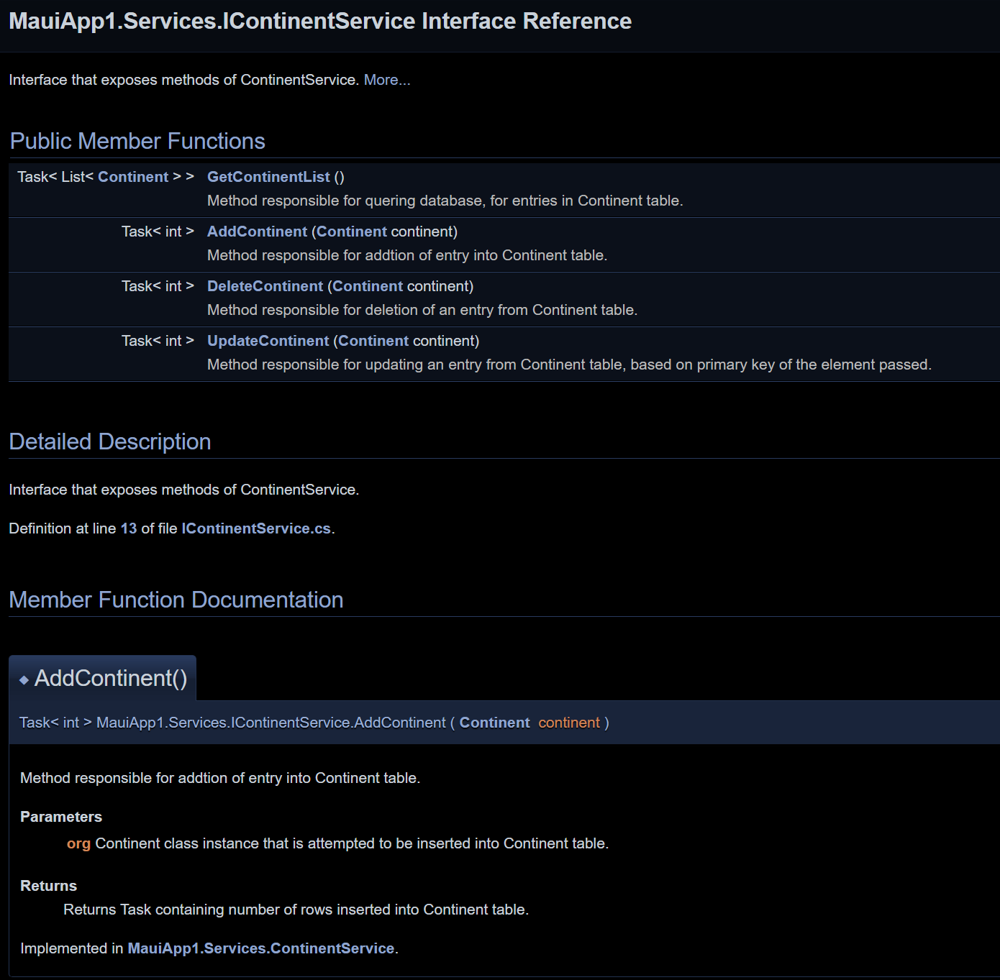
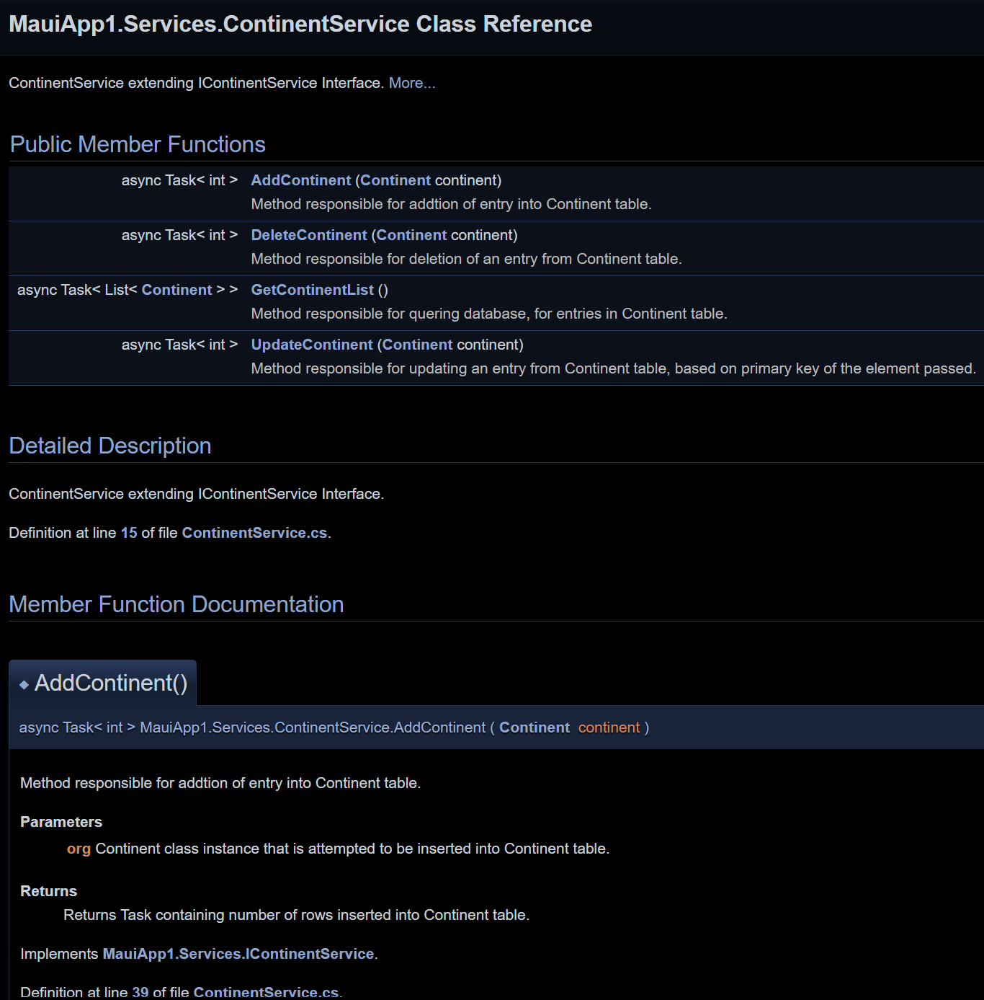

# Documentation
## Applying clean code principles
This section focuses on applying clean code principles to the code we wrote in [week 2](./week2_setup.md).

#### Dependency Inversion Principle
The Dependency Inversion Principle suggest that we should not depend on the specific implementation of lower level module but should instead depend on the abstraction.

In the code from week 2 we instanciate the class `ContinentService` in the constructor. Instead we should use dependency injection of the interface so we only need to depend on the abstraction instead of the concrete service class.

##### Old Code
```csharp
    private IContinentService _continentService;

    public ContinentPage() {
        InitializeComponent();
        this.BindingContext = this;
        this._continentService = new ContinentService();

        Task.Run(async () => await LoadContinents());
        txe_continent.Text = "";
    }
```

##### Fixed Code
```csharp
    private IContinentService _continentService;

    public ContinentPage(IContinentService continentService) {
        InitializeComponent();
        this.BindingContext = this;
        this._continentService = continentService;

        Task.Run(async () => await LoadContinents());
        txe_continent.Text = "";
    }
```


#### DRY
The DRY (Don't Repeat Yourself) principle suggest that we should never write the same or similar code in two different places but instead use methods or parent classes to make the code reusable. Otherwise, if we would have to make any changes we would need to make them in several places.

In this example we are using the same two lines of code at the end of both methods. To fix it we simply need to create a new private method with those two lines and call it at the bottom of the initial methods.

##### Old Code
```csharp
private void SaveButton_Clicked(object sender, EventArgs e) {
    if (String.IsNullOrEmpty(txe_continent.Text)) return;

    if(selectedContinent == null) {
        var continent = new Continent() { Name=txe_continent.Text};
        continentService.AddContinent(continent);
        continents.Add(continent);
    } else {
        selectedContinent.Name = txe_continent.Text;
        continentService.UpdateContinent(selectedContinent);
        var continent = continents.FirstOrDefault(x => x.ID == selectedContinent.ID);
        continent.Name = txe_continent.Text;
    }

    
    selectedContinent = null;
    ltv_continents.SelectedItem = null;
    txe_continent.Text = "";
}

private async void DeleteButton_Clicked(object sender, EventArgs e) {
    if(ltv_continents.SelectedItem == null) {
        await Shell.Current.DisplayAlert("No Continent Selected", "Select the continent you want to delete from the list", "OK");
        return;
    }

    await continentService.DeleteContinent(selectedContinent);
    continents.Remove(selectedContinent);

    ltv_continents.SelectedItem = null;
    txe_continent.Text = "";
}
```

##### Fixed Code
```csharp
private void SaveButton_Clicked(object sender, EventArgs e) {
    if (String.IsNullOrEmpty(txe_continent.Text)) return;

    if(selectedContinent == null) {
        var continent = new Continent() { Name=txe_continent.Text};
        continentService.AddContinent(continent);
        continents.Add(continent);
    } else {
        selectedContinent.Name = txe_continent.Text;
        continentService.UpdateContinent(selectedContinent);
        var continent = continents.FirstOrDefault(x => x.ID == selectedContinent.ID);
        continent.Name = txe_continent.Text;
    }

    
    selectedContinent = null;
    
    SetContinentSelectionNull();
}

private async void DeleteButton_Clicked(object sender, EventArgs e) {
    if(ltv_continents.SelectedItem == null) {
        await Shell.Current.DisplayAlert("No Continent Selected", "Select the continent you want to delete from the list", "OK");
        return;
    }

    await continentService.DeleteContinent(selectedContinent);
    continents.Remove(selectedContinent);

    SetContinentSelectionNull();
}

private void SetContinentSelectionNull() {
    ltv_continents.SelectedItem = null;
    txe_continent.Text = "";
}
```


#### Single Responsibility Principle
The Single Responsibility Principle suggest that one thing should only be responsibly to do one task (have responsibility). That means a class or object should only do one thing but that thing well.

In our code from week 2 we can see that our `ContinentService` sets up a new `SQLiteAsyncConnection` every time it does an operation. The ContinentService should not be responsible for creating the database connection. Instead, we should inject the database connection as a singleton into the constructor of the service and make it reusable but give the responsibility of establishing the connection to someone else.

##### Old Code
```csharp
public class ContinentService : IContinentService
{
    private SQLiteAsyncConnection _dbConnection;

    private async Task SetUpDb() {
        if (_dbConnection != null)
            return;
        

        _dbConnection = new SQLiteAsyncConnection(DatabaseSettings.DBPath, DatabaseSettings.Flags);
        await _dbConnection.CreateTableAsync<Continent>();
    }

    public async Task<int> AddContinent(Continent continent) {
        await SetUpDb();
        return await _dbConnection.InsertAsync(continent);
         
    }

    ...
}
```

##### Fixed Code
```csharp
public class ContinentService : IContinentService
{
    private SQLiteAsyncConnection _dbConnection;

    public ContinentService(SQLiteAsyncConnection dbConnection) {
        _dbConnection = dbConnection;
        await _dbConnection.CreateTableAsync<Continent>();
    }

    public async Task<int> AddContinent(Continent continent) {
        return await _dbConnection.InsertAsync(continent);
    }

    ...
}
```

#### Naming Convention
It is important to have clear and consitent naming conventions for variables, methods, classes and interfaces. If we name everything correctly other programmers can orient themselve better in our codebase.

In our code from week two we have a private variable `selectedContinent`. It is almost the correct name but in C# it is [convention](https://learn.microsoft.com/en-us/dotnet/csharp/fundamentals/coding-style/identifier-names#camel-case) to name private variables with an prefix underscore.

##### Old Code
```csharp
public partial class ContinentPage : ContentPage {

    private Continent selectedContinent = null;

    ...
}
```

##### Fixed Code
```csharp
public partial class ContinentPage : ContentPage {

    private Continent _selectedContinent = null;

    ...
}
```

#### Exception Handling
We need to make use of exception handling for critical operations that can throw exception. If we do not use excpetion handling the software could crash unexpectedly when the user does and operation and that leads to bad UX.

In our code from week two we could make use of exception handling when deleting a continent to make sure the application does not crash if the continent that the user wants to delete does not exist anymore because someone else has already deleted it.


##### Old Code
```csharp
    private async void DeleteButton_Clicked(object sender, EventArgs e) {
        if(ltv_continents.SelectedItem == null) {
            await Shell.Current.DisplayAlert("No Continent Selected", "Select the continent you want to delete from the list", "OK");
            return;
        }

        await continentService.DeleteContinent(selectedContinent);
        continents.Remove(selectedContinent);

        ltv_continents.SelectedItem = null;
        txe_continent.Text = "";
    }
```

##### Fixed Code
```csharp
    private async void DeleteButton_Clicked(object sender, EventArgs e) {
        if(ltv_continents.SelectedItem == null) {
            await Shell.Current.DisplayAlert("No Continent Selected", "Select the continent you want to delete from the list", "OK");
            return;
        }
        try {
        await continentService.DeleteContinent(selectedContinent);
        continents.Remove(selectedContinent);
        } catch(Exception e) {
            await Shell.Current.DisplayAlert("Continent does not exist", "Someone else has already deleted the continent", "OK");
        }

        ltv_continents.SelectedItem = null;
        txe_continent.Text = "";
    }
```

#### Long functions
Long functions is a code smell that arises when a functions is too long and does too many things. When we code too long functions it can be hard for other softwar engineers that read our code to understand what is going on.

In our code from week two we wrote the function `SaveButton_Clicked` which is very long whith a lot of things going on. To remove the code smell we can simply put parts of the method into other private methods and just call them from the `SaveButton_Clicked` method.

##### Old Code
```csharp
    private void SaveButton_Clicked(object sender, EventArgs e) {
        if (String.IsNullOrEmpty(txe_continent.Text)) return;

        if(selectedContinent == null) {
            var continent = new Continent() { Name=txe_continent.Text};
            continentService.AddContinent(continent);
            continents.Add(continent);
        } else {
            selectedContinent.Name = txe_continent.Text;
            continentService.UpdateContinent(selectedContinent);
            var continent = continents.FirstOrDefault(x => x.ID == selectedContinent.ID);
            continent.Name = txe_continent.Text;
        }

        
        selectedContinent = null;
        ltv_continents.SelectedItem = null;
        txe_continent.Text = "";
    }
```

##### Fixed Code
```csharp

private void SaveButton_Clicked(object sender, EventArgs e) {
    if (String.IsNullOrEmpty(txe_continent.Text)) return;

    if(selectedContinent == null) {
        CreateContinent();
    } else {
        UpdateContinent();
    }

    SetContinentSelectionNull();
}

private void SetContinentSelectionNull() {
    ltv_continents.SelectedItem = null;
    txe_continent.Text = "";
}

private void CreateContinent()
{
    var continent = new Continent() { Name=txe_continent.Text};
    continentService.AddContinent(continent);
    continents.Add(continent);
}

private void UpdateContinent()
{
    selectedContinent.Name = txe_continent.Text;
    continentService.UpdateContinent(selectedContinent);
    var continent = continents.FirstOrDefault(x => x.ID == selectedContinent.ID);
    continent.Name = txe_continent.Text;
}
```

## Doxygen comments
For automatic code documentation we can add [Doxygen](https://www.doxygen.nl/) comments to our code.

Doxygen comments are unique comment blocks that start with `/*!` and end with `*/`. They can be multiline.
Inside the comment block we can use html-like tags to describe the code. Commonly used tags are `summary`, `returns` and `param`. For more information have at look in the [documentation](https://www.doxygen.nl/manual/index.html).

Here are some examples of Doxygen comments.

#### Interface
Briefly describes what the interface is for, what the methods should do and what the methods return.
```csharp
   /*! <summary>
       Interface that exposes methods of ContinentService
   </summary> */
   public interface IContinentService
   {
       /*! <summary>
        Method responsible for quering database, for entries in Continent table
       </summary> 
        <returns>Returns Task containing List of Continents present in the database.</returns>*/
       Task<List<Continent>> GetContinentList();

       /*! <summary>
           Method responsible for addtion of entry into Continent table.
       </summary> 
        <param name="org">Continent class instance that is attempted to be inserted into Continent table.</param>
        <returns>Returns Task containing number of rows inserted into Continent table.</returns> */
       Task<int> AddContinent(Continent continent);

       ...
   }
```

In Fig.1 you can see what the html documentation output for the interface looks like.

<figure>

<figcaption align="center"><b>Fig.1 - HTML documentation for an interface</b></figcaption>
</figure>

#### Class
Similar to the interface the comments briefly describe what the class is for. Additionally to comments over methods we also have comments over variables to describe what they are for.
```csharp
/*! <summary>
    ContinentService extending IContinentService Interface
</summary> */
public class ContinentService : IContinentService
{
    /*! <summary>
        Variable storing dbConnection to SQLite database.
    </summary> */
    private SQLiteAsyncConnection _dbConnection;

    /*! <summary>
        Method that initiates connection to SQLite database, and creates Continent class table, if none is present.
    </summary> */
    private async Task SetUpDb() {
        if (_dbConnection != null)
            return;
        

        _dbConnection = new SQLiteAsyncConnection(DatabaseSettings.DBPath, DatabaseSettings.Flags);
        await _dbConnection.CreateTableAsync<Continent>();
    }

...
}
```

In Fig.2 you can see what the html documentation output for the class looks like.

<figure>

<figcaption align="center"><b>Fig.2 - HTML documentation for a class</b></figcaption>
</figure>

## Clean Code
Here are some examples of clean code that do not require any comments because the code itself is descriptive enought.

#### Example 1: Method with naming conventions
The method and variable names in this example are descriptive enough so we do not need any more methods.

```csharp
private void ltv_continents_ItemSelected(object sender, SelectedItemChangedEventArgs e) {
        selectedContinent = e.SelectedItem as Continent;
        if (selectedContinent == null) return;

        txe_continent.Text = selectedContinent.Name;
    }
```

#### Example 2: Model class with namespace
Because of the namespace in the first line we know that this class is supposed to be a model class, hence we do not need any more description with comments. Additionally, all the members have clearly defined names.

```csharp
namespace MauiApp1.Models {
    public class Continent : INotifyPropertyChanged {
        [PrimaryKey, AutoIncrement]
        public int ID { get; set; }

        private string name;
        public string Name {
            get => name;
            set => SetField(ref name, value);
        }

        public event PropertyChangedEventHandler? PropertyChanged;

        protected void OnPropertyChanged(string propertyName) =>
            PropertyChanged?.Invoke(this, new PropertyChangedEventArgs(propertyName));

        protected bool SetField<T>(ref T field, T value, [CallerMemberName] string propertyName = "") {
            if (EqualityComparer<T>.Default.Equals(field, value)) return false;
            field = value;
            OnPropertyChanged(propertyName);
            return true;
        }
    }
}
```

#### Example 2: Interface with naming convention
Similar to the examples above we do not need any comments to make the reader understand what is going on. The name of the interface clarifies that the interface is used to expose the methods of the ContinentService. We also have clear an consitently named methods inside the interface.

```csharp
    public interface IContinentService
    {
        Task<List<Continent>> GetContinentList();

        Task<int> AddContinent(Continent continent);

        Task<int> DeleteContinent(Continent continent);

        Task<int> UpdateContinent(Continent continent);
    }
```