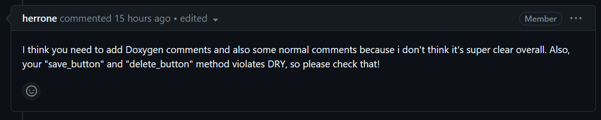
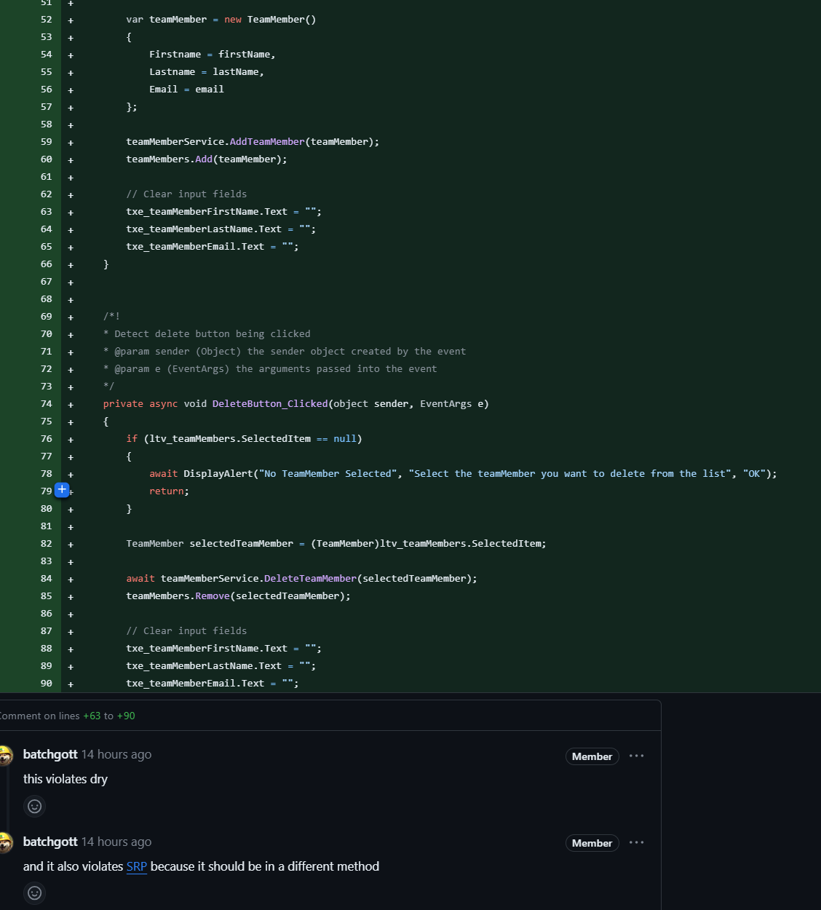

# Project work 1
This week I worked on this issue:

```
End user goal: To form operational sub-teams as efficiently as possible

End business goal: To allow the mission to react in an agile fashion to local priorities

Acceptance criteria:

Operational sub-team requirements can be specified (e.g. size, skills required, start and end dates of assignment, etc.)
Team members can be viewed and filtered by location, skill and current availability
List filters can be cleared
Team members can be added to the operational sub-team
Team members are shown as unavailable while assigned to an operational sub-team
Notes:
Operational requirements (e.g. purpose, location, etc.) are created and prioritised by the Disaster Management Coordinator. These requirements are passed to the Deputy Team Leader who assesses the size of team needed and the skills required.
```


## Code
In this section I am going to discuss some of the code I wrote.

### Model
The first thing we need is to create model classes for `Team` and `TeamMember`. 
The model classes implement the `INotifyPropertyChanged` changed interface. That is used for calling an event to inform the View about updating a property.

The idea behind using model classes is to map tables of a database to an object representation in the code. This concept is called [Object-relational mapping](https://en.wikipedia.org/wiki/Object%E2%80%93relational_mapping). It is a widely used design choice across many different technologies and languages, regardless of the size of the project.

```csharp
public class Team : INotifyPropertyChanged
{
    [PrimaryKey, AutoIncrement]
    public int id { get; set; }
    private int maxSize;
    public int MaxSize
    {
        get => maxSize;
        set => SetField(ref maxSize, value);
    }

    private string skillsRequired;
    public string SkillsRequired
    {
        get => skillsRequired;
        set => SetField(ref skillsRequired, value);
    }

    private DateTime startDate;
    public DateTime StartDate
    {
        get => startDate;
        set => SetField(ref startDate, value);
    }

    private DateTime endDate;
    public DateTime EndDate
    {
        get => endDate;
        set => SetField(ref endDate, value);
    }

    public event PropertyChangedEventHandler PropertyChanged;
    protected void OnPropertyChanged(string propertyName) =>
        PropertyChanged?.Invoke(this, new PropertyChangedEventArgs(propertyName));

    protected bool SetField<T>(ref T field, T value, [CallerMemberName] string propertyName = "")
    {
        if (EqualityComparer<T>.Default.Equals(field, value)) return false;
        field = value;
        OnPropertyChanged(propertyName);
        return true;
    }
}

public class TeamMember : INotifyPropertyChanged
{
    [PrimaryKey, AutoIncrement]
    public int id { get; set; }
    private string firstname;
    public string Firstname
    {
        get => firstname;
        set => SetField(ref firstname, value);
    }

    private string lastname;
    public string Lastname
    {
        get => lastname;
        set => SetField(ref lastname, value);
    }

    private string email;
    public string Email
    {
        get => email;
        set => SetField(ref email, value);
    }

    public event PropertyChangedEventHandler PropertyChanged;
    protected void OnPropertyChanged(string propertyName) =>
        PropertyChanged?.Invoke(this, new PropertyChangedEventArgs(propertyName));

    protected bool SetField<T>(ref T field, T value, [CallerMemberName] string propertyName = "")
    {
        if (EqualityComparer<T>.Default.Equals(field, value)) return false;
        field = value;
        OnPropertyChanged(propertyName);
        return true;
    }
}
```

### View

Next, a view needs to be created to show the data of the Team and the TeamMembers. The XAML language is used to create the view.

By putting the view and the model into different layers is a software design principle called [Divide and Conquer](https://www.getyourguide.careers/posts/applying-the-divide-and-conquer-pattern-in-software-engineering#:~:text=Divide%20and%20conquer%2C%20in%20computer,complexity%20of%20non%2Dtrivial%20tasks.). We divide our problem into multiple layers and have the layers communicate with each other. In our case the layers are the model and the logic for the view. 

```csharp
<?xml version="1.0" encoding="utf-8"?>
<ContentPage xmlns="http://schemas.microsoft.com/dotnet/2021/maui"
             xmlns:x="http://schemas.microsoft.com/winfx/2009/xaml"
             x:Class="MauiApp1.Views.TeamPage"
             Title="TeamPage">
    <VerticalStackLayout Spacing="10" Margin="5">
        <Editor x:Name="txe_team"
                Placeholder="Add an alert type"
                HeightRequest="100" />

        <Grid ColumnDefinitions="*,*" ColumnSpacing="4">
            <Button Text="Save"
                    Clicked="SaveButton_Clicked" />

            <Button Grid.Column="1"
                    Text="Delete"
                    Clicked="DeleteButton_Clicked" />
        </Grid>

        <ListView x:Name="ltv_teams" Background="white" ItemSelected="ltv_alerttypes_ItemSelected">
            <ListView.ItemTemplate>
                <DataTemplate>
                    <TextCell TextColor="Black" Text="{Binding Name}"/>
                </DataTemplate>
            </ListView.ItemTemplate>
        </ListView>
    </VerticalStackLayout>
</ContentPage>
```


### Test
The following two test, test the adding of a new Team and updating and existing team. There is more tests than that in the code but this is code snipped is just to give a general idea on what the tests look like.

We are making use of a mocking library to mock the code we do not want to test.


```csharp
 public class TeamPageTest
 {
     [Fact]
     public void SaveButton_Clicked_AddsNewTeam()
     {
         var teamPage = new TeamPage();
         var teamServiceMock = new Mock<ITeamService>();
         teamPage._TeamService = teamServiceMock.Object;

         teamPage.txe_team.Text = "New Team";
         teamPage.SaveButton_Clicked(null, null);

         teamServiceMock.Verify(service => service.AddTeam(It.IsAny<Team>()), Times.Once);
     }

     [Fact]
     public void SaveButton_Clicked_UpdatesExistingTeam()
     {
         var teamPage = new TeamPage();
         var teamServiceMock = new Mock<ITeamService>();
         teamPage._TeamService = teamServiceMock.Object;

         var existingTeam = new Team { ID = 1, Name = "Old Name" };
         teamPage._selectedTeam = existingTeam;

         teamPage.txe_team.Text = "Updated Team";
         teamPage.SaveButton_Clicked(null, null);

         teamServiceMock.Verify(service => service.UpdateTeam(existingTeam), Times.Once);
         Assert.Equal("Updated Team", existingTeam.Name);
     }

     ...
 }
```


## Code review

In the code review I received the following comment (Fig.1):

<figure>

<figcaption align="center"><b>Fig.1 - Code review comment</b></figcaption>
</figure>

### Adding doxygen comments
So to reflect on the changes I have added some doxygen comments:

```csharp
    /*! <summary>
     * Determine a class named SystemType which implements the INotifyPropertyChanged interface.
     * </summary>
     * <details>Data is stored in SQLite database.</details> 
    */
    public class Team : INotifyPropertyChanged
    {
        /*! <summary>
        * Determine a primary key and auto-increment property named 'id'.
        * </summary> 
        */
        [PrimaryKey, AutoIncrement]
        public int id { get; set; }
        /*! <summary>
         * Determine a private field 'maxSize' to store the value of the 'MaxSize' property.
         * </summary> 
         */
        private int maxSize;
        /*! <summary>
        * Determine a public property 'MaxSize' that gets and sets the 'maxSize' field.
        * SetField method is a helper method to set the field and invoke PropertyChanged event.                                              
        * </summary> 
        */
        public int MaxSize
        {
            get => maxSize;
            set => SetField(ref maxSize, value);
        }
        /*! <summary>
        * Determine a private field 'skillsRequired' to store the value of the 'SkillsRequired' property.
        * </summary> 
        */
        private string skillsRequired;
        /*! <summary>
        * Determine a public property 'SkillsRequired' that gets and sets the 'skillsRequired' field.
        * SetField method is a helper method to set the field and invoke PropertyChanged event.                                              
        * </summary> 
        */
        public string SkillsRequired
        {
            get => skillsRequired;
            set => SetField(ref skillsRequired, value);
        }
...
```

### Following the DRY principle
To follow the dry principle we can put duplicate lines into a method and just call the method:


```csharp
    private void SaveButton_Clicked(object sender, EventArgs e)
    {
        if (String.IsNullOrEmpty(txe_team.Text)) return;

        if (_selectedTeam == null)
        {
            var Team = new Team() { Name = txe_team.Text };
            _TeamService.AddTeam(Team);
            _Teams.Add(Team);
        }
        else
        {
            _selectedTeam.Name = txe_team.Text;
            _TeamService.UpdateTeam(_selectedTeam);
            var Team = _Teams.FirstOrDefault(x => x.ID == _selectedTeam.ID);
            Team.Name = txe_team.Text;
        }
        SetSelectedItemNull();
    }

    private async void DeleteButton_Clicked(object sender, EventArgs e)
    {
        if (txe_team.SelectedItem == null)
        {
            await Shell.Current.DisplayTeam("No Team types Selected", "Select the Team type you want to delete from the list", "OK");
            return;
        }

        await _TeamService.DeleteTeam(_selectedTeam);
        _Teams.Remove(_selectedTeam);
        SetSelectedItemNull();
    }

    private void SetSelectedItemNull()
    {
        txe_team.SelectedItem = null;
        txe_team.Text = "";
    }
```

## Reviewing code
I was asked to conduct a code review for this [PR](https://github.com/Software-Engineering-Red/MAUI-APP/pull/101). I found the following issues in the code (Fig.2):


<figure>

<figcaption align="center"><b>Fig.2 - Comments in the code review</b></figcaption>
</figure>

The code violates the **DRY** principle because the same code is written twice in two different methods (line 63-65 and line 88-90).

The code also violates the **Single Responsibility Principle** as both methods do more than the method name suggest. This is another reason why we should put some of the logic into seperate methods and simply call those methods.