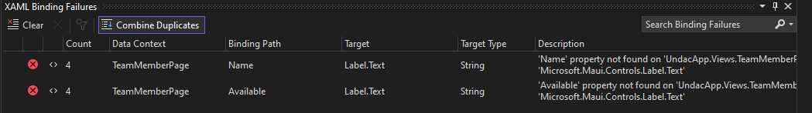

# Project work 2
This week I worked on improving the TeamMember page. There were several issues with the implementation of the TeamMember feature introduced last week so this week I decided to do some refactoring to improve the overall code.

I also added some classes that will help to speed up the development in the future like a generalized abstract `AService` class as well as a general `AModel` class to abstract repeated code.

The TeamMember feature is part of [this issue](https://github.com/Software-Engineering-Red/MAUI-APP/issues/71).

To be able to show the availability of a TeamMember accurately inside the view I create an value converter class that can be used inside the XAML file to transform the availability boolean value to a string that says "Available" or "Not Available".


## Refactoring the code base by Abstraction
[Abstraction](https://en.wikipedia.org/wiki/Abstraction_(computer_science)) is a concept in software engineering to generalize repeated code in an abstract base class. In a nutshell it helps to employ the [DRY-Principle](https://en.wikipedia.org/wiki/Don%27t_repeat_yourself).

In our code base so far we had a lot of repeated code. That would often cause issues if we needed to do small changes we would have to do it in all places the same code is used. 

For instance, in [this PR](https://github.com/Software-Engineering-Red/MAUI-APP/pull/103/files#diff-6ccdb003a294569852d8ce2ef4df1b761b599ecdcc5f8b9a59b56c7e57b207bdL21) someone wanted to change the name of the method `SetField` to `ChangeProperty`. Because this code is repeated in all model classes they had to change it in 13 different places.

### Abstract Model
The create a generalized model I added a new class `AModel`. This class implements the `INotifyPropertyChanged` interface that all other models need to reflect changes in the view. Additionally it also had the `ID` property which is also needed in every model to use as the primary key.

```csharp
    public abstract class AModel : INotifyPropertyChanged
    {
        [PrimaryKey, AutoIncrement]
        public int ID { get; set; }

        public event PropertyChangedEventHandler? PropertyChanged;

        protected void OnPropertyChanged(string propertyName) =>
            PropertyChanged?.Invoke(this, new PropertyChangedEventArgs(propertyName));

        protected bool SetField<T>(ref T field, T value, [CallerMemberName] string propertyName = "")
        {
            if (EqualityComparer<T>.Default.Equals(field, value)) return false;
            field = value;
            OnPropertyChanged(propertyName);
            return true;
        }
    }
```

With this abstract class every model can now simply inherit from it and add additional properties. Here is an example for the `TeamMember` class.

```csharp
    public class TeamMember : AModel
    {
        public TeamMember()
        {
            Available = true;
        }

        private string _name;
        public string Name
        {
            get => _name;
            set => SetField(ref _name, value);
        }

        private bool _available;
        public bool Available
        {
            get => _available;
            set => SetField(ref _available, value);
        }
    }
```

### Abstract Service
The same issue we had with the model classes is also true for the service classes. Up until now every service class has a `SetUpDb` method and then [CRUD](https://en.wikipedia.org/wiki/Create,_read,_update_and_delete) methods for the specific model. Those methods look the same in all service classes. We want to avoid repeated code so I create a generic and Abstract `AService` class.

```csharp
    public interface IService<T> where T : AModel,new()
    {
        Task<T> GetOne(int id);
        Task<List<T>> GetAll();
        Task<int> Add(T entity);
        Task<int> Update(T entity);
        Task<int> Remove(T entity);
        Task<bool> Exists(int id);
    }

    public abstract class AService<T> : IService<T> where T : AModel,new()
    {
        private SQLiteAsyncConnection _database;

        public AService() {
            _database = new SQLiteAsyncConnection(DatabaseSettings.DBPath, DatabaseSettings.Flags);
            _database.CreateTableAsync<T>().Wait();
        }
        public async Task<T> GetOne(int id) {
            return await _database.Table<T>().Where(t => t.ID == id).FirstOrDefaultAsync();
        }
        public async Task<List<T>> GetAll() {
            return await _database.Table<T>().ToListAsync();
        }
        public async Task<int> Add(T entity) {
            return await _database.InsertAsync(entity);
        }
        public async Task<int> Update(T entity) {
            return await _database.UpdateAsync(entity);
        }
        public async Task<int> Remove(T entity) {
            return await _database.DeleteAsync(entity);
        }
        public async Task<bool> Exists(int id) {
            return await GetOne(id) != null;
        }
    }
```

In this abstract class the database connection gets established in the constructor, which means if another service class inherits from `AService` and gets instantiated the DB connection will be created automatically.
Additionally, there are generic CRUD methods that work for every model class that inherits from `AModel` and is not an abstract object (because if the [`new()` contraint](https://learn.microsoft.com/en-us/dotnet/csharp/language-reference/keywords/new-constraint?redirectedfrom=MSDN)).

We are also adding an `IService` interface simply because we want to define a contract on how the CRUD method needs to look like. This way it is easier to change the implementation of `AService` to a different class while also not breaking other parts of the code that inherit from `IService`.


Now, in order to create a new service class for a model this is all we need to do:

```csharp
    public class TeamMemberService : AService<TeamMember>, ITeamMemberService {}
    public interface ITeamMemberService : IService<TeamMember> {}
```

We can now also add more specific methods for the `TeamMember` model.

### *IValueConverter* for the Availability of a TeamMember
The best datatype to record the availability of a TeamMember is a bool. Unfortunately, displaying a bool value in the view to accurately letting the user know about a TeamMember availability is not trivial. We need to convert the bool to a string that reflects the availability.

MAUI has a feature that lets us do exactly that. Its the `IValueConverter` interface that we can use to write our own value converters. For converting the availability bool value I created the following class: 

```csharp
    public class BoolToAvailabilityConverter : IValueConverter
    {
        public object Convert(object value, Type targetType, object parameter, CultureInfo culture)
        {
            return value is bool ? ((bool)value ? "Available" : "Not Available") : "Not Available";
        }

        public object ConvertBack(object value, Type targetType, object parameter, CultureInfo culture)
        {
            return value is string ? ((string)value == "Available" ? true : false) : false;
        }
    }
```

It converts a bool to the string "Available" or "Not Available" and also converts the string back to a bool. In the view we can use it in combination with databinding like this:

<figure>

<figcaption align="center"><b>Fig.1 - Databinding with the IValueConverter</b></figcaption>
</figure>

Fig.1 shows how we can declare the ValueConverter at the top as a resource and later use is for the databound Availability property.


## Reflection
### Abstraction
A lot of code quality improvements happened in this weeks portfolio entry. First and foremost abstracting the Model and Service classes will benefit the project in the long term is it made everything more expandable and maintainable.

### Fixing View Error
Another thing to add to the reflection is some issue that were fixed in the view. So far there were a lot of databinding issues that we did not know how to resolve. It caused the following error for every entity that was displayed in the view:

<figure>

<figcaption align="center"><b>Fig.2 - Errors in the view</b></figcaption>
</figure>

It turns out that it is actually quite an easy fix. In the page classes, instead of setting the `BindingContext` to `this`, we had to set it to a new instance of the model class that we are using so the view knows its properties.

```csharp
public partial class TeamMemberPage : ContentPage
{
    ITeamMemberService teammemberService;

    public TeamMemberPage() {
        InitializeComponent();
        Teammembers = new ObservableCollection<TeamMember>();
        this.BindingContext = new TeamMember();
        ...
    }
    ...
}
```

### Using XAML and MAUI Feature
XAML and MAUI have a lot of feature that make leave a lot easier if used correctly. For example the `IValueConvert` for the TeamMember availability that I created this week helps a lot for displaying data accuratly in the view without having to transform it every time.

Another thing that could make sense to try in future weeks is the [Two-way Binding](https://learn.microsoft.com/en-us/dotnet/maui/fundamentals/data-binding/binding-mode#two-way-bindings). That would be especially convenient when updating values of an entity without having to call an extra method.

___

In week 9, you are continuing with the team project. Your portfolio entry should 
demonstrate how your software engineering practice is improving. It should include
much the same content as last week's:

* A descriptive summary of the issue that you worked on.
* Snippets from your code with commentary showing how you have used good software design 
  practice.
* A descriptive summary of the test code that you have written.
* A reflective summary of any changes that were requested during the code review along 
  with your fixes.
* A descriptive summary of any issues you found with the code that you were asked to review.
* A general reflective section that identifies, for example,
  * New things you have realised this week
  * Common problems that can arise in a team development situation
  * How your practice compares to other people's
  * etc.

